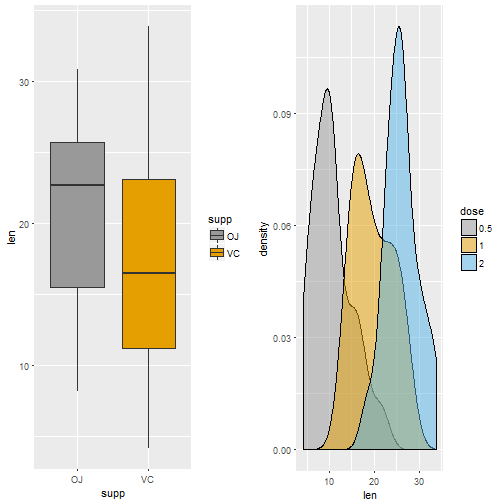
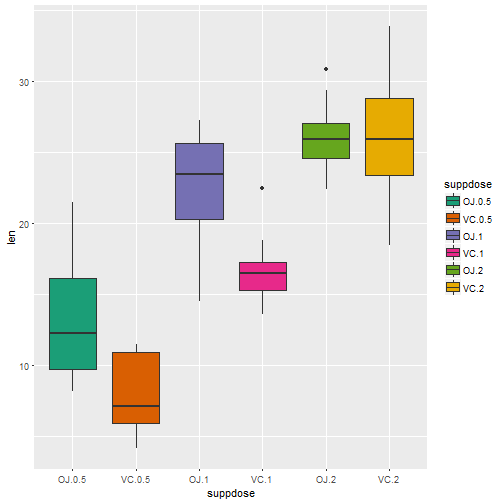

## Objectives
In the second portion of the project, we're going to analyze the ToothGrowth data in the R datasets package.

1. Load the ToothGrowth data and perform some basic exploratory data analyses

2. Provide a basic summary of the data.

3. Use confidence intervals and/or hypothesis tests to compare tooth growth by supp and dose.

4. State your conclusions and the assumptions needed for your conclusions.

## Load Packages and Dataset

```r
library(plyr)
library(ggplot2)
```

```
## Warning: package 'ggplot2' was built under R version 3.4.4
```

```r
library(datasets)
library(grid)

data(ToothGrowth)
```

## Basic Summary of Data

```r
tooth.data <- data.frame(ToothGrowth)
dim(tooth.data)
```

```
## [1] 60  3
```

```r
head(tooth.data)
```

```
##    len supp dose
## 1  4.2   VC  0.5
## 2 11.5   VC  0.5
## 3  7.3   VC  0.5
## 4  5.8   VC  0.5
## 5  6.4   VC  0.5
## 6 10.0   VC  0.5
```

```r
# supplement and dose
# convert two variables to factors
tooth.data$supp <- factor(tooth.data$supp)
tooth.data$dose <- factor(tooth.data$dose)

# plotting
plot.1 <- ggplot(tooth.data, aes(x=supp, y=len)) + geom_boxplot(aes(fill=supp)) + scale_fill_manual(values=c("#999999", "#E69F00"))
plot.2 <- ggplot(tooth.data, aes(x=len, fill=dose)) + geom_density(alpha = 0.5) + scale_fill_manual(values=c("#999999", "#E69F00", "#56B4E9"))
pushViewport(viewport(layout = grid.layout(1, 2)))
print(plot.1, vp = viewport(layout.pos.row = 1, layout.pos.col = 1))
print(plot.2, vp = viewport(layout.pos.row = 1, layout.pos.col = 2))
```



```r
# create a new variable
tooth.data$suppdose <- interaction(tooth.data$supp, tooth.data$dose)
ggplot(aes(y=len, x = suppdose), data = tooth.data) + geom_boxplot(aes(fill=suppdose)) + scale_fill_brewer(palette="Dark2")
```



"ggplot2" is a great tool, make plotting easier, however after exploring data, there is no obvious relationship among variables.

## compare tooth growth by supp and dose
calculate confidence intervals and p-values

### Supplement Groups
Comparing difference between supplement groups only

```r
# Conduct t-test (because it is a small sample size), and create a data frame to store the result.
t1 <- t.test(len~supp, paired=F, var.equal=F, data=tooth.data)
t1.summary <- data.frame("p-value"=c(t1$p.value),"CI-Lower"=c(t1$conf[1]), "CI-Upper"=c(t1$conf[2]), row.names=c("OJ vs. VC:  "))
round(t1.summary,4)
```

```
##              p.value CI.Lower CI.Upper
## OJ vs. VC:    0.0606   -0.171    7.571
```

### Dosage Groups
To compare difference between dosage groups, the dose values can be paired to three groups, and be compared per group:

1. 0.5mg and 1mg (Group 1)

2. 0.5mg and 2mg (Group 2)

3. 1mg and 2mg (Group 3)


```r
#subset the groups
df.05.dose <- subset(tooth.data, tooth.data$dose==.5)
df.10.dose <- subset(tooth.data, tooth.data$dose==1)
df.20.dose <- subset(tooth.data, tooth.data$dose==2)

# t-test
t.group1 <- t.test(df.05.dose$len, df.10.dose$len, paired=F, var.equal=F)
t.group2 <- t.test(df.05.dose$len, df.20.dose$len, paired=F, var.equal=F)
t.group3 <- t.test(df.10.dose$len, df.20.dose$len, paired=F, var.equal=F)

# store the result
t2.summary <- data.frame("p-value"=c(t.group1$p.value, t.group2$p.value, t.group3$p.value), "CI-Lower"=c(t.group1$conf[1], t.group2$conf[1], t.group3$conf[1]), "CI-Upper"=c(t.group1$conf[2], t.group2$conf[2], t.group3$conf[2]), row.names=c(".5mg vs 1mg: ", ".5mg vs 2mg: ","1mg vs 2mg: "))
round(t2.summary, 6)
```

```
##               p.value   CI.Lower   CI.Upper
## .5mg vs 1mg:  0.0e+00 -11.983781  -6.276219
## .5mg vs 2mg:  0.0e+00 -18.156167 -12.833833
## 1mg vs 2mg:   1.9e-05  -8.996481  -3.733519
```

### Comparing supplement within each dosage group

```r
t05 <- t.test(len~supp, paired=F, var.equal=F, data=df.05.dose)
t10 <- t.test(len~supp, paired=F, var.equal=F, data=df.10.dose)
t20 <- t.test(len~supp, paired=F, var.equal=F, data=df.20.dose)

t3.summary <- data.frame("p-value"=c(t05$p.value,t10$p.value,t20$p.value), 
     "CI-Lower"=c(t05$conf[1],t10$conf[1],t20$conf[1]),
     "CI-Upper"=c(t05$conf[2],t10$conf[2],t20$conf[2]),
     row.names=c(".5mg OJ vs. VC: ", "1mg OJ vs. VC: ","2mg OJ vs. VC: "))

round(t3.summary, 6)
```

```
##                   p.value  CI.Lower CI.Upper
## .5mg OJ vs. VC:  0.006359  1.719057 8.780943
## 1mg OJ vs. VC:   0.001038  2.802148 9.057852
## 2mg OJ vs. VC:   0.963852 -3.798070 3.638070
```

## Conclusion
At first glance, the supplement seems not to be a significant variable as the p-value is greater than 0.05 (0.061) and the confidence intervals contain 0.

However, this assumption is false. By observing supplement for each dosage group, the p-values of 0.5mg dosage and 1.0mg dosage of both types of supplement are between 0.001 and 0.01 (0.006 and 0.001 respectively). And the confidence intervals do not contain 0. Therefore, supplement at each dosage level is significant to tooth growth. Also, higher dosage may have a more significant effect.
