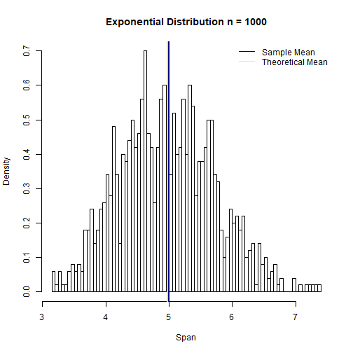
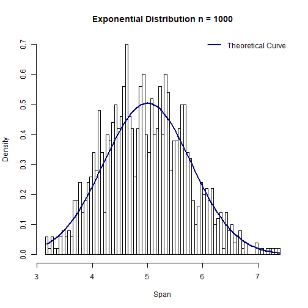
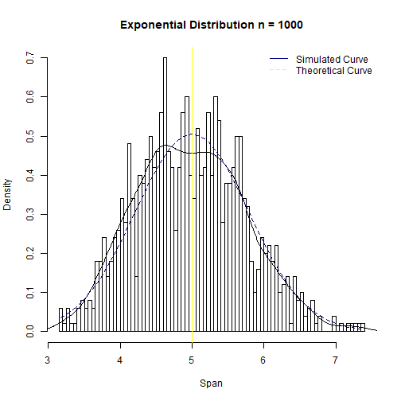
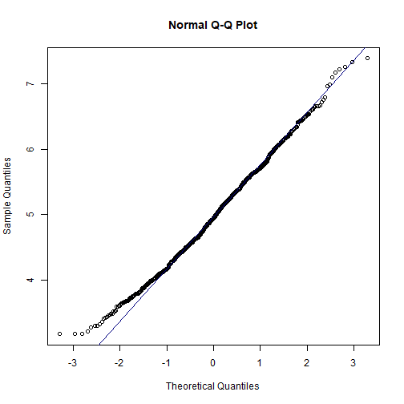

## Overview
In this project I will investigate the exponential distribution in R and compare it with the Central Limit Theorem. The exponential distribution can be simulated in R with rexp(n, lambda) where lambda is the rate parameter. The mean of exponential distribution is 1/lambda and the standard deviation is also 1/lambda. Set lambda = 0.2 for all of the simulations. I will run 1000 simulations (each contains 40 observations) to investigate the distribution of averages of 40 exponentials.

My goal is to illustrate via simulation and associated explanatory text the properties of the distribution of the mean of 40 exponentials. Three objectives will be acheived here:

* illustrate the sample mean and compare it to the theoretical mean of the distribution. 

* illustrate how variable the sample is comparing to the theoretical variance of the distribution.

* illustrate that the distribution is approximately normal.

## Simulation
### Sample Mean Vs. Theoretical Mean
First, I will run 1000 simulations to create a dataset, each simulation will contain 40 observations and the exponential distribution function will be set to "rexp(40, 0.2)".

```r
lambda <- 0.2
n <- 40 
nosim <- 1000
set.seed(1234)
```

perform simulation and collect data:

```r
exp.sim <- function(n, lambda)
            {
              mean(rexp(n,lambda))
            }
              sim <- data.frame(ncol=2,nrow=1000)
              names(sim) <- c("Index","Mean")
            for (i in 1:nosim)
            {
              sim[i,1] <- i
              sim[i,2] <- exp.sim(n,lambda)
            }
```

Mean of 1000 Simulations

```r
sample.mean <- mean(sim$Mean)
sample.mean
```

```
## [1] 4.974239
```

### Theoretical exponential mean of exponential distribution

```r
theory.exp.mean <- 1/lambda
theory.exp.mean
```

```
## [1] 5
```
### The simulation mean is 4.97 which is very close to the theoretical mean of 5

### create a histogram to illustrate this exponential distribution:

```r
hist(sim$Mean, 
      breaks = 100, 
      prob = TRUE, 
      main="Exponential Distribution n = 1000", 
      xlab="Span")
      
abline(v = theory.exp.mean, 
        col= "navy",
        lwd = 2)
                        
abline(v = sample.mean, 
        col = "yellow",
        lwd = 2)

legend('topright', c("Sample Mean", "Theoretical Mean"), 
        bty = "n",       
        lty = c(1,1), 
        col = c(col = "navy", col = "yellow"))
```



## Sample Variance vs Theoretical Population Variance
Compare the variance in the sample means (n = 1000) to the theoretical variance of population

Variance of sample means can estimate the variance of population by using

* sigma^2 = Variance of sample means x N

```r
sample.var <- var(sim$Mean)
theory.var <- ((1/lambda)^2)/40
sample.var
```

```
## [1] 0.5706551
```

```r
theory.var
```

```
## [1] 0.625
```

Create a histogram illustrating theoretical variance

```r
hist(sim$Mean, 
     breaks = 100, 
     prob = TRUE, 
     main = "Exponential Distribution n = 1000", 
     xlab = "Span")
     
xfit <- seq(min(sim$Mean), max(sim$Mean), length = 100)
yfit <- dnorm(xfit, mean = 1/lambda, sd = (1/lambda/sqrt(40)))
lines(xfit, yfit, pch = 22, col = "navy", lwd = 2)
legend('topright', c("Theoretical Curve"), 
lty = 1,lwd = 2, bty = "n", col = "navy")
```



Create another histogram with the comparison to simulated variance

```r
hist(sim$Mean, 
      breaks = 100, 
      prob = TRUE, 
      main = "Exponential Distribution n = 1000", 
      xlab = "Span")
                        
lines(density(sim$Mean))
abline(v = 1/lambda, col = "yellow")
xfit <- seq(min(sim$Mean), max(sim$Mean), length = 100)
yfit <- dnorm(xfit, mean = 1/lambda, sd = (1/lambda/sqrt(40)))
lines(xfit, yfit, pch = 22, col = "navy", lty = 2)
                        
legend('topright', c("Simulated Curve", "Theoretical Curve"), 
        bty = "n", lty = c(1,2), col = c("navy", "yellow"))
```



Based on the central limit theorem, the samples means follow normal distribution. The figure above illustrates that the density plotted with simulated variance approximately matches the density plotted with theoretical variance.

## Illustrate that the distribution is approximately normal

```r
qqnorm(sim$Mean, 
      main ="Normal Q-Q Plot")
      qqline(sim$Mean, 
      col = "navy")
```



The Normal Q-Q plot illustrates the normality. The simulated quantiles again match closely with the theoretical quantiles. Therefore, it is proven that the distribution is approximately normal distribution.
